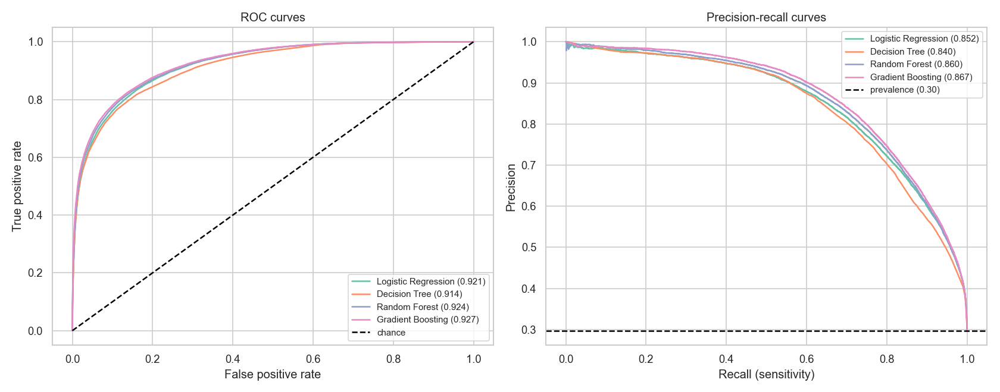

# Predicting Hospital Admission at Emergency Department Triage

**Author:** Justin Moore

## Executive summary

Emergency departments get crowded largely because of boarding, where patients who have already been
admitted wait in the ED for an inpatient bed to open up. A lot of that delay traces back to how late
the admission decision gets made. If we could tell at triage which patients are likely to be
admitted, the hospital could start looking for a bed hours earlier. This project builds a model to do
that, using only what is known when the triage nurse finishes their assessment.

The data is a public cohort of 560,486 ED visits. Working from a strict leakage-controlled feature
set (no labs or imaging, since those come after triage), I compared a logistic regression against a
decision tree, a random forest, and gradient boosting. Gradient boosting performed best with a test
AUROC of 0.927, but the more useful finding is that the simple logistic regression is within about
half a percentage point of it (0.921) while staying fully interpretable. At a threshold set to catch
about 90% of admissions, the best model flags roughly 44% of arrivals for early bed planning.

## Rationale

Boarding is bad for patients (worse outcomes, longer stays) and hard on hospital operations. The
admission decision often is not settled until labs and imaging come back, which can be hours after
the patient arrives. An estimate of admission probability at triage would let charge nurses and bed
managers get the admission process moving earlier instead of waiting for the workup to finish.

## Research Question

Can we predict whether an ED patient will be admitted to the hospital using only information
available at triage?

This is a binary classification problem: `disposition` is Admit (1) versus Discharge (0).

## Data Sources

- Dataset: hospital triage and patient-history data (Yale ED cohort), public and fully de-identified.
- Reference: Hong WS, Haimovich AD, Taylor RA. "Predicting hospital admission at emergency department
  triage using machine learning." PLoS ONE 2018;13(7):e0201016.
- Size: 560,486 visits and 972 columns covering demographics, triage vitals, chief complaints, prior
  medical history, prior utilization, and post-triage labs and imaging.
- Target balance: 70.3% Discharge, 29.7% Admit (about 2.36 to 1).

The raw data (around 1.5 GB) is not in this repository. It can be downloaded from Kaggle. The
expected local path is in `requirements.txt` and the notebook header.

## Methodology

The notebook follows the CRISP-DM process.

1. Data understanding: profiled the target, data types, and missingness. Missingness is split, with
   about 380 columns complete and about 350 more than half empty (mostly lab values).
2. Leakage control: this was the main decision in the project. I sorted every column by when its
   value becomes known and kept the 554 features available at triage (ESI, triage vitals, chief
   complaints, demographics, prior medical history, prior utilization). I dropped the 416 features
   that only exist after triage: lab aggregates (`_last`, `_min`, `_max`, `_median`), lab and imaging
   counts (`_count`, `_npos`), and repeated in-department vitals.
3. Data preparation: removed 2 exact duplicate rows, set physiologically impossible vital values to
   missing, median-imputed the numeric features, added indicator flags so missingness is kept as
   signal, and one-hot encoded the categoricals with an explicit "Missing" level (636 features total).
4. Feature engineering: abnormal-vital flags (tachycardia, hypotension, hypoxia, fever, tachypnea),
   shock index (HR/SBP), counts of comorbidities, complaints, and medication classes, and age bands.
5. Modeling: a DummyClassifier floor, a logistic regression baseline, and three tree-based models
   (decision tree, random forest, gradient boosting). Tree models used the raw feature matrix
   (they are scale-invariant); logistic regression used a standardized matrix. To keep tuning
   affordable on 448k rows, I grid-searched each model on a 50,000-row stratified subsample of the
   training data with 3-fold cross-validation, then refit the chosen settings on the full training
   set and evaluated once on the held-out test set. Support vector machines and k-nearest neighbors
   were left out as impractical at this scale.

On metrics: the classes are imbalanced at roughly 70/30, so accuracy is the wrong thing to optimize.
A model that predicts "discharge" for everyone is 70% accurate and useless. I report AUROC as the
main metric, since it measures ranking quality independent of any threshold and is standard for
clinical risk scores, along with AUPRC, which is more sensitive to the admitted patients. I also
report the confusion matrix and sensitivity/specificity, because in this setting a missed admission
matters more than a false alarm.

## Results

Metrics are on the held-out test set. Sensitivity, specificity, PPV, and alert rate are reported at a
threshold tuned to catch about 90% of admissions.

| Model | CV AUROC | Test AUROC | Test AUPRC | Sensitivity | Specificity | PPV | Alert rate |
|---|---|---|---|---|---|---|---|
| Dummy (majority class) | 0.500 | 0.500 | 0.297 | n/a | n/a | n/a | n/a |
| Logistic Regression | 0.915 | 0.921 | 0.852 | 0.90 | 0.746 | 0.600 | 0.446 |
| Decision Tree | 0.905 | 0.914 | 0.840 | 0.90 | 0.706 | 0.565 | 0.475 |
| Random Forest | 0.917 | 0.924 | 0.860 | 0.90 | 0.752 | 0.605 | 0.442 |
| **Gradient Boosting** | **0.924** | **0.927** | **0.867** | 0.90 | **0.759** | **0.613** | **0.437** |

- Gradient boosting is the best model, but only by a small margin. Logistic regression trails it by
  about half a point of AUROC while being fully interpretable.
- At the 90% sensitivity operating point, gradient boosting reaches 76% specificity and flags 44% of
  patients. To catch nine of every ten future admissions, the model flags a little under half of all
  arrivals for early bed planning. The threshold is a policy choice and can be moved.
- The top features agree across all three model types: ESI acuity, number of prior medication
  classes, age, whether the patient was admitted on a previous visit, and arrival by ambulance.
  These are the same signals clinicians already weigh at triage.
- Admission rate tracks ESI closely, falling from 85.6% at ESI 1 to 0.4% at ESI 5.

## Deployment considerations

A model like this would not be put into clinical use as it stands. It would need ongoing monitoring
and periodic retraining, because triage practices and patient mix drift over time. Because the
features include race, insurance, and age, it would have to be audited for fairness across those
groups before any clinical use. And the output is a probability, not a decision: it should support a
charge nurse or bed manager rather than replace clinical judgment.

## Limitations

- This is a prediction, not a causal finding. The model says who is likely to be admitted. It does
  not show that acting on the prediction improves outcomes or reduces boarding, which would take a
  prospective trial.
- The data comes from a single health system, so the model would need to be tested on other sites
  before being used.
- I kept a few historical fields (`previousdispo`, `n_admissions`) because they pre-date the visit.
  A more conservative version could drop them.
- The tree models were tuned on a 50,000-row subsample and refit on the full training set. A full
  search on all 448k rows could shift the chosen settings slightly, though the cross-validated scores
  were stable.

## Next steps

1. Validate the model on data from a different time period or hospital before trusting it in
   practice, since this cohort is from a single health system.
2. Audit the model for fairness across race, insurance, and age groups and confirm its error rates
   are acceptable for each.
3. Run a prospective evaluation to test whether acting on the predictions actually shortens boarding,
   which this retrospective data cannot show.
4. If the last bit of performance matters, run a fuller hyperparameter search on the full training
   set rather than the subsample used here.

## Outline of project

- [Capstone analysis notebook](notebooks/capstone_analysis.ipynb)

## Contact and Further Information

Justin Moore

GitHub: [@moorej44](https://github.com/moorej44)
